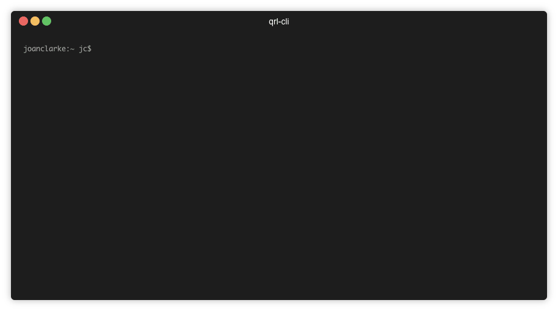

qrl-cli
=======

QRL CLI functions

[](https://oclif.io)
[](https://npmjs.org/package/@theqrl/cli)
[](https://circleci.com/gh/theQRL/qrl-cli)
[](https://codecov.io/gh/theQRL/qrl-cli)
[](https://github.com/theqrl/qrl-cli/blob/master/package.json)



<!-- toc -->
* [Usage](#usage)
* [Commands](#commands)
<!-- tocstop -->
# Usage
<!-- usage -->
```sh-session
$ npm install -g @theqrl/cli
$ qrl-cli COMMAND
running command...
$ qrl-cli (-v|--version|version)
@theqrl/cli/1.8.0 linux-x64 node-v10.16.3
$ qrl-cli --help [COMMAND]
USAGE
  $ qrl-cli COMMAND
...
```
<!-- usagestop -->
# Commands
<!-- commands -->
* [`qrl-cli balance ADDRESS`](#qrl-cli-balance-address)
* [`qrl-cli create-wallet`](#qrl-cli-create-wallet)
* [`qrl-cli generate-lattice-keys`](#qrl-cli-generate-lattice-keys)
* [`qrl-cli get-keys`](#qrl-cli-get-keys)
* [`qrl-cli help [COMMAND]`](#qrl-cli-help-command)
* [`qrl-cli ots ADDRESS`](#qrl-cli-ots-address)
* [`qrl-cli receive ADDRESS`](#qrl-cli-receive-address)
* [`qrl-cli search SEARCH`](#qrl-cli-search-search)
* [`qrl-cli send QUANTITY`](#qrl-cli-send-quantity)
* [`qrl-cli send-message`](#qrl-cli-send-message)
* [`qrl-cli status`](#qrl-cli-status)
* [`qrl-cli validate ADDRESS`](#qrl-cli-validate-address)

## `qrl-cli balance ADDRESS`

Get a wallet balance from the network for an address

```
USAGE
  $ qrl-cli balance ADDRESS

ARGUMENTS
  ADDRESS  QRL address or wallet.json file to return a balance for

OPTIONS
  -g, --grpc=grpc          Custom grcp endpoint to connect a hosted QRL node (-g 127.0.0.1:19009)
  -m, --mainnet            Queries mainnet network for the address balance
  -p, --password=password  Encrypted QRL wallet.json password to decrypt
  -q, --quanta             Reports the QRL address balance in Quanta
  -s, --shor               Reports the QRL address balance in Shor
  -t, --testnet            Queries testnet network for the address balance

DESCRIPTION
  Queries the balance of the wallet.json file or address. 
  Use the (-p) flag to pass the password of encrypted wallet file.

  Documentation at https://docs.theqrl.org/developers/qrl-cli
```

_See code: [src/commands/balance.js](https://github.com/theqrl/qrl-cli/blob/v1.8.0/src/commands/balance.js)_

## `qrl-cli create-wallet`

Create a new QRL wallet

```
USAGE
  $ qrl-cli create-wallet

OPTIONS
  -1, --sha2256            (default) Use SHA2-256 hashing mechanism
  -2, --shake128           Use SHAKE-128 hashing mechanism
  -3, --shake256           Use SHAKE-256 hashing mechanism
  -f, --file=file          Create QRL wallet to a json file (wallet.json)
  -h, --height=height      (default: 10) XmSS merkle tree height or OTS height (even numbers 4-18)
  -p, --password=password  Encrypt the wallet file with this password

DESCRIPTION
  QRL addresses can be created with various tree height (-h) and hashing mechanisms (1-3)
  You can output to a file (-f) in JSON and encrypt with a user set password (-p).

  Documentation at https://docs.theqrl.org/developers/qrl-cli
```

_See code: [src/commands/create-wallet.js](https://github.com/theqrl/qrl-cli/blob/v1.8.0/src/commands/create-wallet.js)_

## `qrl-cli generate-lattice-keys`

Generate new Kyber & Dilithium lattice key pairs aliong with an ECDSA key and (optionally) broadcast them onto the network.

```
USAGE
  $ qrl-cli generate-lattice-keys

OPTIONS
  -b, --broadcast                          Send lattice keys to the network from the address given
  -c, --crystalsFile=crystalsFile          (c)reate Lattice keys JSON file
  -e, --crystalsPassword=crystalsPassword  Password to (e)ncrypt lattice keys file
  -f, --fee=fee                            (default: 100) QRL (f)ee for transaction in Shor
  -g, --grpc=grpc                          Custom grcp endpoint to connect a hosted QRL node (-g 127.0.0.1:19009)
  -i, --otsindex=otsindex                  OTS key (i)ndex for broadcast transaction
  -j, --json                               Print lattice keys in JSON format to stdout
  -m, --mainnet                            Send lattice key transaction to (m)ainnet
  -p, --walletPassword=walletPassword      Encrypted QRL wallet file (p)assword
  -s, --hexseed=hexseed                    Hex(s)eed/Mnemonic of QRL address where funds should be sent from
  -t, --testnet                            Send the lattice key transaction to (t)estnet
  -w, --wallet=wallet                      Generating QRL (w)allet file used for broadcasting lattice keys (wallet.json)

DESCRIPTION
  This function REQUIRES a valid QRL wallet file or private keys (hexseed/mnemonic) to use 
  for generating and validating these lattice keys. Pass only one, wallet.json file OR hexseed/mnemonic.

  By default generate-lattice-keys will print new lattice keys to stdout.

  Save lattice keys to a file with the (-c) --crystalsFile flag and a file name. Encrypt the file with
  the (-e) flag and give the new AES encryption passphrase. The output file will be encrypted using this passphrase.

  Use the broadcast (-b) flag and a valid otsindex (-i) to broadcast the lattice keys to the QRL network using the 
  addres provided.

  Documentation at https://docs.theqrl.org/developers/qrl-cli
```

_See code: [src/commands/generate-lattice-keys.js](https://github.com/theqrl/qrl-cli/blob/v1.8.0/src/commands/generate-lattice-keys.js)_

## `qrl-cli get-keys`

Get lattice keys associated to a QRL address or transaction hash that have been broadcast to the network

```
USAGE
  $ qrl-cli get-keys

OPTIONS
  -T, --txhash=txhash                Transaction hash to lookup for lattice keys
  -a, --address=address              QRL address for lattice key lookup
  -f, --pub_key_file=pub_key_file    Print found public lattice keys to json (f)ile
  -g, --grpc=grpc                    Custom grcp endpoint to connect a hosted QRL node (-g 127.0.0.1:19009)
  -i, --item_per_page=item_per_page  (default 1) How many (i)tems to return per page for address lookup
  -j, --json                         Print the public keys in json format
  -m, --mainnet                      Queries mainnet for the lattice keys
  -p, --page_number=page_number      (default 1) Which (p)age to print for address lookup
  -t, --testnet                      Queries testnet for the lattice keys

DESCRIPTION
  Command requires that either a transaction hash or QRL address to lookup is given and the network must match where the 
  transactionwas made.

  For general address lookups, use page number and items returned number to limit your search. 
  qrl-cli get-keys -i 1 -p 1 -a {ADDRESS} - will print the first key if found at that address. 

  Found public lattice keys can be writen to a json file with the (-f) flag, default will print lattice keys to stdout
```

_See code: [src/commands/get-keys.js](https://github.com/theqrl/qrl-cli/blob/v1.8.0/src/commands/get-keys.js)_

## `qrl-cli help [COMMAND]`

display help for qrl-cli

```
USAGE
  $ qrl-cli help [COMMAND]

ARGUMENTS
  COMMAND  command to show help for

OPTIONS
  --all  see all commands in CLI
```

_See code: [@oclif/plugin-help](https://github.com/oclif/plugin-help/blob/v2.2.3/src/commands/help.ts)_

## `qrl-cli ots ADDRESS`

Get a address's OTS state from the network

```
USAGE
  $ qrl-cli ots ADDRESS

ARGUMENTS
  ADDRESS  QRL address to return OTS state for

OPTIONS
  -g, --grpc=grpc          Custom grcp endpoint to connect a hosted QRL node (-g 127.0.0.1:19009)
  -m, --mainnet            (default) Queries mainnet for the OTS state
  -p, --password=password  wallet file password if encrypted
  -t, --testnet            Queries testnet for the OTS state

DESCRIPTION
  Reports the next unused available OTS key. Pass either an address starting with 
  QQ0004 or a wallet.json file to se the next OTS. You can set the network flag with either (-t) testnet or (-m) mainnet

  If the wallet file is encrypted use the -p flag to pass the wallet file encryption password.
```

_See code: [src/commands/ots.js](https://github.com/theqrl/qrl-cli/blob/v1.8.0/src/commands/ots.js)_

## `qrl-cli receive ADDRESS`

Displays a QR code of the QRL address to receive a transaction

```
USAGE
  $ qrl-cli receive ADDRESS

ARGUMENTS
  ADDRESS  QRL address to display QR code for

OPTIONS
  -p, --password=password  Encrypted QRL wallet file password

DESCRIPTION
  Prints the QRL address in both textual and QR format. Pass either an address or a wallet.json file
  If using an encrypted wallet file pass the encryption password with the (-p) flag.
```

_See code: [src/commands/receive.js](https://github.com/theqrl/qrl-cli/blob/v1.8.0/src/commands/receive.js)_

## `qrl-cli search SEARCH`

Searches for a transaction, block or address

```
USAGE
  $ qrl-cli search SEARCH

ARGUMENTS
  SEARCH  a search term: address/txhash/block to query API for

OPTIONS
  -g, --grpc=grpc  Custom grcp endpoint to connect a hosted QRL node (-g 127.0.0.1:19009)
  -j, --json       Prints output to json
  -m, --mainnet    q(default Queries mainnet for the address/txhash/block
  -t, --testnet    Queries testnet for the address/txhash/block

DESCRIPTION
  Fetches data about queried transaction/block/address. Defaults to mainnet; network selection flags are (-m) mainnet, 
  (-t) testnet. 
  Advanced: you can use a custom defined node to query for status. Use the (-g) grpc endpoint.
```

_See code: [src/commands/search.js](https://github.com/theqrl/qrl-cli/blob/v1.8.0/src/commands/search.js)_

## `qrl-cli send QUANTITY`

Send Quanta

```
USAGE
  $ qrl-cli send QUANTITY

ARGUMENTS
  QUANTITY  Number of Quanta (Shor if -s flag set) to send

OPTIONS
  -R, --file=file              JSON file of recipients
  -f, --fee=fee                Fee for transaction in Shor (defaults to 100 Shor)
  -g, --grpc=grpc              advanced: grpc endpoint (for devnet/custom QRL network deployments)
  -h, --hexseed=hexseed        hexseed/mnemonic of wallet from where funds should be sent
  -i, --otsindex=otsindex      (required) OTS key index
  -j, --jsonObject=jsonObject  Pass a JSON object of recipients/quantities for multi-output transactions
  -m, --mainnet                uses mainnet to send the transaction
  -p, --password=password      wallet file password
  -r, --recipient=recipient    QRL address of recipient
  -s, --shor                   Send in Shor
  -t, --testnet                uses testnet to send the transaction
  -w, --wallet=wallet          JSON file of wallet from where funds should be sent

DESCRIPTION
  ...
  TODO
```

_See code: [src/commands/send.js](https://github.com/theqrl/qrl-cli/blob/v1.8.0/src/commands/send.js)_

## `qrl-cli send-message`

Send up to 80 byte message on the network

```
USAGE
  $ qrl-cli send-message

OPTIONS
  -M, --message=message      Message data to send
  -f, --fee=fee              QRL (f)ee for transaction in Shor (defaults to 100 Shor)
  -g, --grpc=grpc            advanced: grpc endpoint (for devnet/custom QRL network deployments)
  -i, --otsindex=otsindex    Unused OTS key (i)ndex for message transaction
  -m, --mainnet              queries mainnet for the OTS state
  -p, --password=password    Encrypted QRL wallet file (p)assword
  -r, --recipient=recipient  QRL address of recipient
  -s, --hexseed=hexseed      Secret hex(s)eed/mnemonic of address message should be sent from
  -t, --testnet              queries testnet for the OTS state
  -w, --wallet=wallet        JSON (w)allet file message will be sent from

DESCRIPTION
  Message can be sent to a recipient with the (-r) flag
  You can select either (-m) mainnet or (-t) testnet

  Advanced: you can use a custom defined node to query for status. Use the (-g) grpc endpoint.
```

_See code: [src/commands/send-message.js](https://github.com/theqrl/qrl-cli/blob/v1.8.0/src/commands/send-message.js)_

## `qrl-cli status`

Gets the network status from a node

```
USAGE
  $ qrl-cli status

OPTIONS
  -g, --grpc=grpc  Custom grcp endpoint to connect a hosted QRL node (-g 127.0.0.1:19009)
  -m, --mainnet    queries mainnet for the OTS state
  -t, --testnet    queries testnet for the OTS state

DESCRIPTION
  Reports network status from the node queried. You can select either (-m) mainnet or (-t) testnet
  Advanced: you can use a custom defined node to query for status. Use the (-g) grpc endpoint.
```

_See code: [src/commands/status.js](https://github.com/theqrl/qrl-cli/blob/v1.8.0/src/commands/status.js)_

## `qrl-cli validate ADDRESS`

Validate a QRL address

```
USAGE
  $ qrl-cli validate ADDRESS

ARGUMENTS
  ADDRESS  QRL address to validate

OPTIONS
  -q, --quiet  Quiet mode: no address details, just return validity via exit code

DESCRIPTION
  ...
  when passed a QRL address in hexstring (preceded by 'Q'), will return details about the addresses validity.
```

_See code: [src/commands/validate.js](https://github.com/theqrl/qrl-cli/blob/v1.8.0/src/commands/validate.js)_
<!-- commandsstop -->
